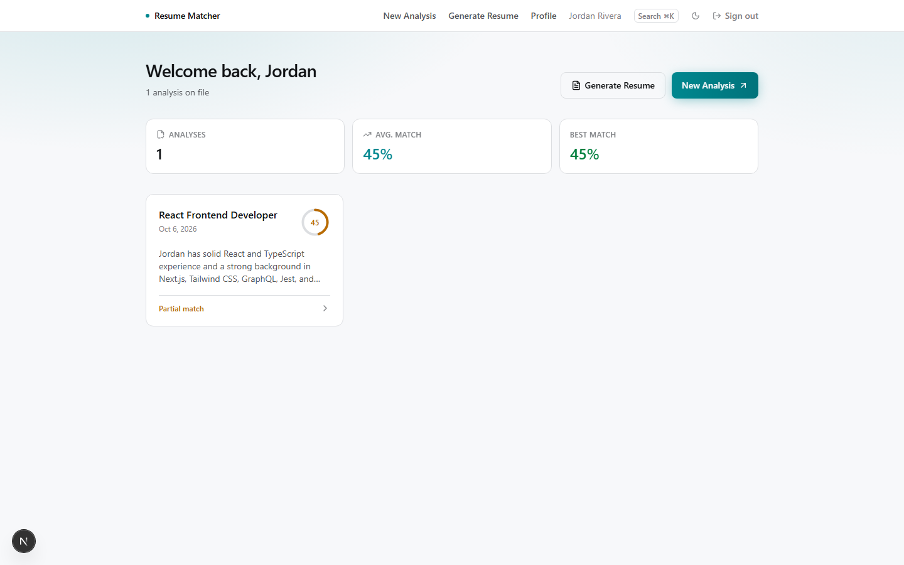
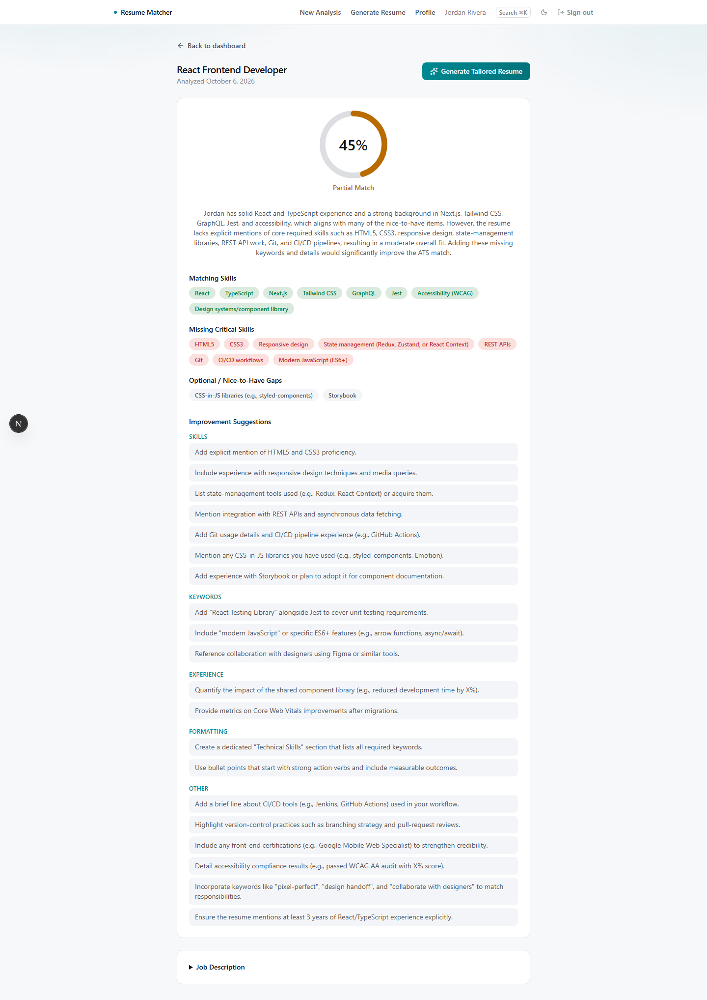
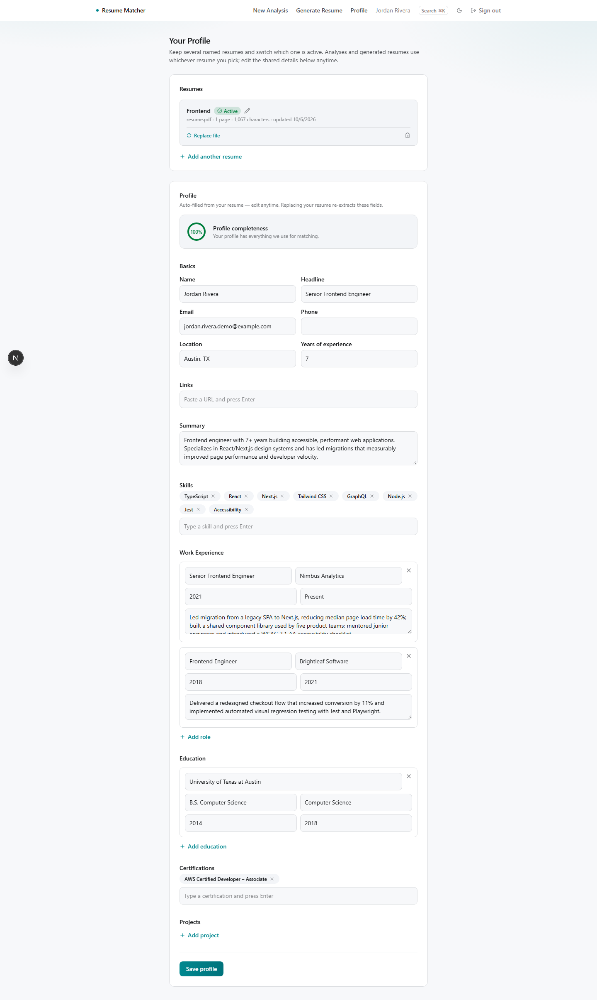
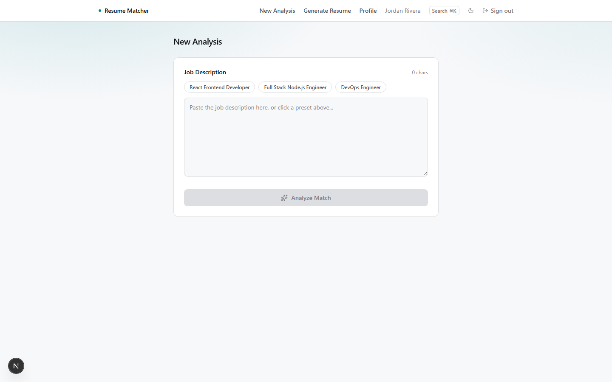
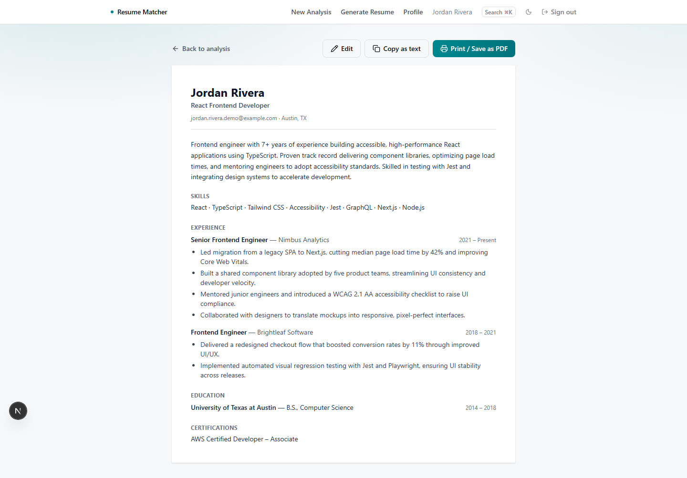

# AI Resume Screener & ATS Matcher

Users sign up, upload a resume once, and match it against as many job descriptions as they like -- every analysis is saved to their dashboard with a match score, and clicking into one shows the full breakdown (skills matrix, suggestions, the original JD). Runs entirely on free-tier infrastructure: Next.js on Vercel Hobby + Groq's API (OpenAI-compatible, free tier) + Supabase (Postgres + Auth, free tier). PDF parsing happens client-side (`pdfjs-dist`), so raw files never hit the server -- only extracted text does, and only the extracted text is stored.

## Tech stack

- **Framework**: Next.js 16 (App Router, Turbopack), React 19, TypeScript
- **Styling**: Tailwind CSS v4 (CSS custom properties, OKLCH, dark-first theme)
- **Database / Auth**: Supabase (Postgres + Row Level Security, email/password auth)
- **AI**: Groq (OpenAI-compatible structured output, free tier)
- **Validation**: Zod, shared between the AI JSON schema and the safety-net validator
- **PDF parsing**: `pdfjs-dist`, client-side only
- **Testing**: Vitest

## Live demo

Not deployed yet -- clone and run it locally with your own free Supabase + Groq keys using the steps below (a few minutes).

## Screenshots

| Dashboard | Analysis detail |
|---|---|
|  |  |

| Profile (multiple resumes) | New analysis |
|---|---|
|  |  |

| Tailored resume output |
|---|
|  |

## Setup

1. Install dependencies:
   ```
   npm install
   ```
2. **Groq** (AI analysis): get a free key at [console.groq.com/keys](https://console.groq.com/keys) ("Create API Key").
3. **Supabase** (auth + database):
   - Create a free project at [supabase.com/dashboard](https://supabase.com/dashboard).
   - In the SQL Editor, run the contents of [`supabase/schema.sql`](./supabase/schema.sql) once -- this creates the `profiles` and `job_analyses` tables, their Row Level Security policies, and a trigger that auto-creates a profile row on signup.
   - Then run [`supabase/add-resumes-table.sql`](./supabase/add-resumes-table.sql) once -- this adds the `resumes` table (multiple named resumes per account) and its supporting columns/policies.
   - Copy the Project URL and `anon` public key from Project Settings -> Data API.
   - **For a quick demo**, disable email confirmation so signup works instantly: Authentication -> Sign In / Providers -> Email -> turn off "Confirm email". Otherwise, new users must click a confirmation link before they can sign in -- if you keep it on, edit the "Confirm signup" email template's URL to `{{ .SiteURL }}/auth/confirm?token_hash={{ .TokenHash }}&type=email&next=/dashboard` (see `app/auth/confirm/route.ts`).
4. Copy the env example and fill in your keys:
   ```
   cp .env.local.example .env.local
   ```
5. Run the dev server:
   ```
   npm run dev
   ```
   Open [http://localhost:3000](http://localhost:3000).

## How it fits together

- `proxy.ts` -- refreshes the Supabase session on every request and redirects unauthenticated users to `/login` (API routes are exempt; they return their own 401 JSON instead).
- `/signup`, `/login` -- email/password auth via Supabase.
- `/profile` -- manage up to 5 named resumes (`resumes` table) and switch which one is active; edits a set of shared profile fields (name, skills, experience, etc.) that stay in sync with whichever resume is active.
- `/analyze` -- pick which resume to match, paste or pick a sample job description; the server reads that resume's text (never trusts client-submitted resume text), calls Groq, saves the result as a new `job_analyses` row, and sets that resume as the account's active one.
- `/dashboard` -- every past analysis as a card (title + score); `/dashboard/[jobId]` shows the full detail.
- All per-user data isolation is enforced by Postgres Row Level Security (`supabase/schema.sql`), not just app-level checks.

## Deploying to Vercel

Set `GROQ_API_KEY`, `GROQ_MODEL` (optional), `NEXT_PUBLIC_SUPABASE_URL`, and `NEXT_PUBLIC_SUPABASE_ANON_KEY` in Project Settings -> Environment Variables for both Production and Preview before deploying. If you're using real email confirmation, also add your deployed URL to Supabase's Authentication -> URL Configuration -> Redirect URLs.

## Scripts

- `npm run dev` -- start the dev server
- `npm run build` -- production build
- `npm run start` -- run the production build locally
- `npm run lint` -- ESLint
